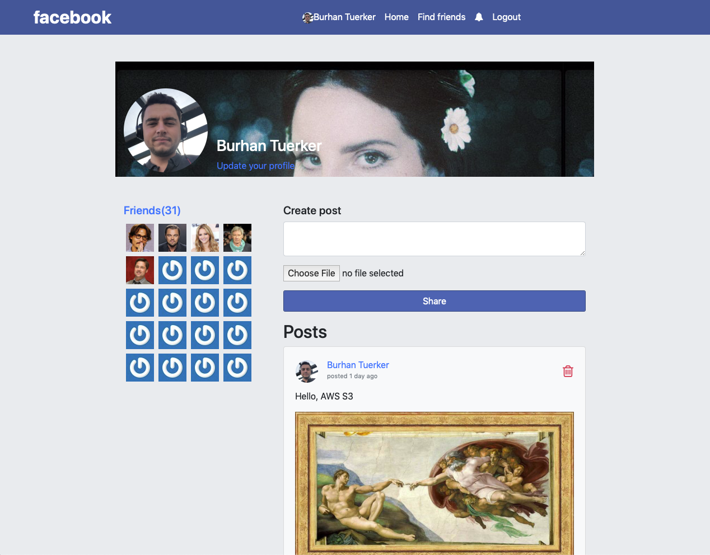
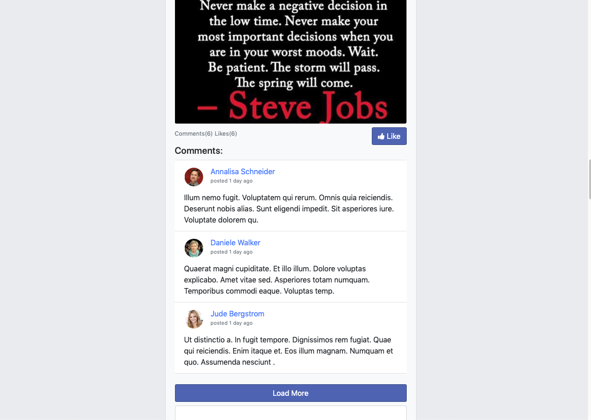
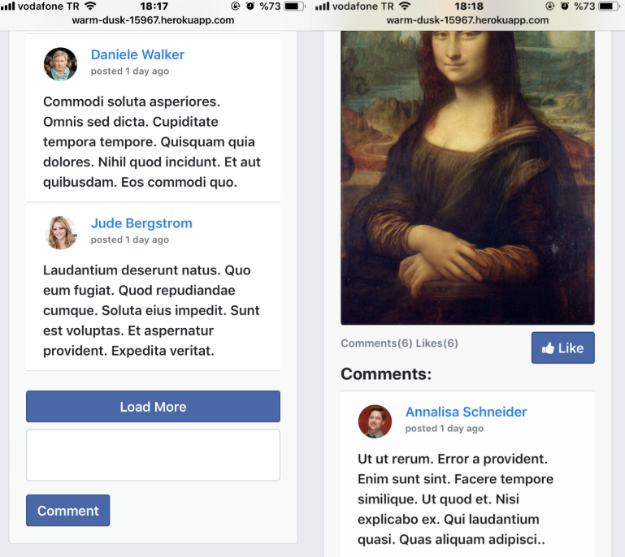

# facebook-clone project
Facebook implementation with Ruby on Rails
## Installation Guide
### Prerequisities
System dependencies:
```
$ ruby -v
  ruby 2.6.1p33 (2019-01-30 revision 66950) [x86_64-darwin18]

$ rails -v
  Rails 5.2.3

$ bundler -v
  Bundler version 2.0.1

$ postgres --version
  postgres (PostgreSQL) 11.2
```

#### Local setup
##### Clone project
```
$ git clone https://github.com/btuerker/odin-facebook.git
$ cd ./odin-facebook
```
##### Install dependencies
```
(if required update bundler)
$ gem update --system && gem install bundler && bundler update --bundler
$ bundle install
```
##### Configure database
```
(make sure the database is running)
(run psql with default superuser of postgresql(mostly it's postgres), if it's not check postgresql's installation documentation)
$ psql postgres
$ postgres=# CREATE ROLE facebook_dev LOGIN PASSWORD 'password' CREATEDB CREATEROLE SUPERUSER;
(Then the new role should be appeared with \du command)
$ postgres=# \du
                                     List of roles
  Role name   |                         Attributes                         | Member of 
--------------+------------------------------------------------------------+-----------
 burhanturker | Superuser, Create role, Create DB, Replication, Bypass RLS | {}
 facebook_dev | Superuser, Create role, Create DB                          | {}
```
##### Setup database(from application folder)
```
$ rails db:create
$ rails db:migrate
$ rails db:seed (Optionally to use mock data)
```
##### Run the server
```
$ rails s
```
Now, check the [localhost:3000](http://localhost:3000)

#### Container setup(docker & docker-compose)
##### Clone project
```
$ git clone https://github.com/btuerker/odin-facebook.git
$ cd ./odin-facebook
```
##### Build and run with docker-compose(from application folder)
```
$ docker-compose build
$ docker-compose up
(For now, application is up on localhost:3000], but for initially, there's no db created by our configuration)
(First of all, we need to handle database creation manually)
In another terminal session run:
    $ docker-compose run app rails db:create RAILS_ENV=container
    $ docker-compose run app rails db:migrate RAILS_ENV=container
    $ docker-compose run app rails db:seed RAILS_ENV=container (Optionally)
```
Now everything should ok, check the [localhost:3000](http://localhost:3000)

#### Deployment(Heroku)
```
$ git clone https://github.com/btuerker/odin-facebook.git
$ cd ./odin-facebook
$ heroku create
(Then the heroku remote should be appeared with $ git remote show)
$ git remote show 
  heroku
  origin
(AWS S3 Storage configurations)
$ heroku config:set AWS_ACCESS_KEY_ID:{AWS_ACCESS_KEY_ID}
$ heroku config:set AWS_SECRET_ACCESS_KEY:{AWS_SECRET_ACCESS_KEY}
$ heroku config:set S3_BUCKET_NAME:{AWS_S3_BUCKET_NAME}

$ git push heroku master
$ heroku run rails db:create
$ heroku run rails db:seed 
```
#### Live Preview(Heroku)
(I'm using AWS Education Account, the keys I've used should be expired, but it can get images from cloud storage)
[Preview](https://warm-dusk-15967.herokuapp.com)
###### Demo account -> email:burhan.tuerker@gmail.com password:password 


# Page Previews
### Browser


### Mobile


